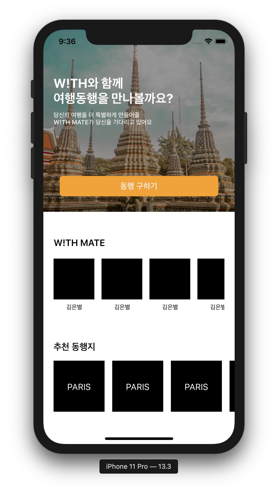
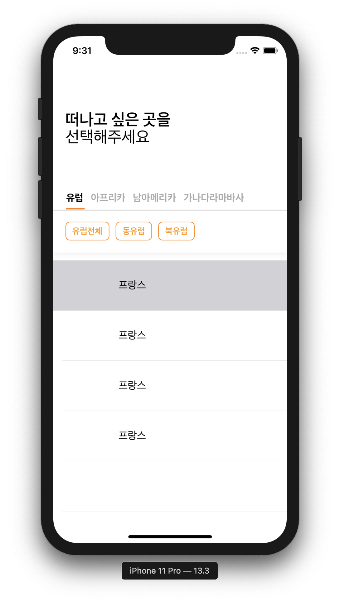
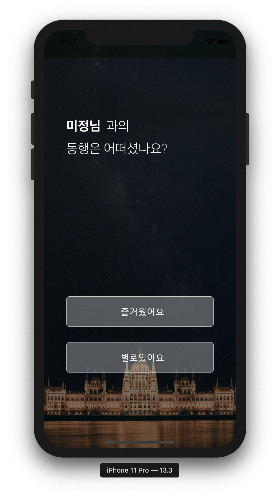

# WITH

__2019.12.21 ~ 2020.01.03__

### iOS

* 김남수
* 권준

## Work Flow

## 개발 환경 및 라이브러리

* Alamofire
* SwiftLint
* Kingfisher
*  Firebase

## 기능

* 홈
  * 메인화면
  * 게시글 필터화면
  * 후기글 작성화면
  
* 채팅

  * 채팅방 레이아웃

  * 채팅목록

    

## 실행 화면

## 개발간 문제점

* 소스트리의 미숙한 사용
* socketio, firebase 사이에서의 고민
* iOS13 푸쉬 알람 버그
* 채팅말풍선 알고리즘
  * 경우의 수에 따라 다르게 출력되는 채팅출력
* 자간설정시 말풍선 사이즈와 라벨 사이즈
  * cellForRowAt에서 설정시 이상현상발생
  * 셀이 생성될때 초기화시 정상적인 출력
  * 동적인 셀크기를 할당할때 위치가 맞지않음
* CollectionView에서 동적으로 길어지는 Label길이에 대응하는 셀의 크기 맞추기
* 한 ViewController에 여러개의 CollectionView가 존재할때 구분하는 방법
* select와 deselect를 이용한 이벤트 처리하기

### 기획

* 현환희
* 안현준

### 디자이너

* 김루희
* 김미정
* 김은별

### 서버 [Page](https://github.com/TEAM-WITH/WITH_Server)

* 김민준
* 박형모
* 조연주
* 조하담

### 안드로이드 [Page](https://github.com/TEAM-WITH/WITH_Android)

* 조현아
* 최승준
* 석영현