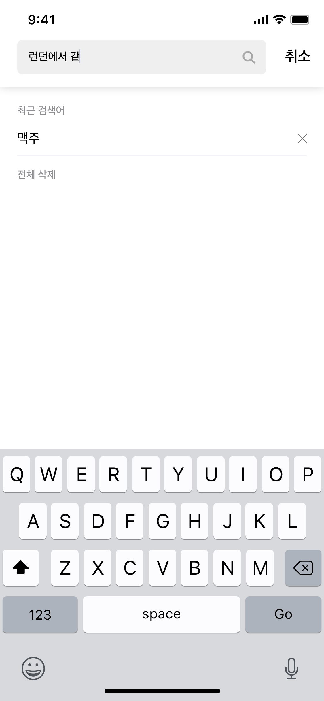

# WITH

__2019.12.21 ~ 2020.01.03__
✈️🚅🛳🏎🏄🍺🍷🧃🍧☀️🌈🌍🌃🌌🛤📕📗💜🇬🇧🚞🇫🇷🇷🇺

### 💜iOS💜

* 김남수 [Repo](https://github.com/namsoo5)😄
* 권준 [Repo](https://github.com/junnegeem)😁

</br>

</br>

## Work Flow

<div>

</div>

</br>

</br>

## 개발 환경 및 라이브러리

* Alamofire - 4.8.2
* SwiftLint - 0.38.0
* Kingfisher - 5.0
* FMDB - 2.7.5
* Firebase
* lottie-ios

</br>

</br>

## 기능

### 로그인화면
| 분류 | 기능 | 구현 | 비고 |
|----|----|----|----|
|회원가입|기본 정보를 입력 디자인|✅||
|회원가입|앨범에 있는 사진 첨부|✅||
|회원가입|Multi-Part 서버통신|✅||
|로그인|서버통신을 통한 유저식별|✅||

### 홈화면
| 분류 | 기능 | 구현 | 비고 |
|----|----|----|----|
|메인|동행 확정된 사람 통신|✅||
|메인|추천 여행지 통신|✅||
|메인|최근 게시물 디자인|✅| 통신❌|
|메인|이벤트 게시물|✅||
|게시글|처음 사용시 지역선택화면 이동|✅||
|게시글|지역별 리스트 통신|✅||
|게시글|지역 필터별 통신|✅|국가, 날짜, 성별|
|게시글|게시글 작성 디자인|✅| 통신❌|
|게시글|상세 게시글 통신|✅||
|게시글|상세 게시글에서 채팅창 입장하기|❌||

### 채팅화면
| 분류 | 기능 | 구현 | 비고 |
|----|----|----|----|
|채팅목록|채팅 목록 통신|✅||
|채팅목록|채팅 목록 파이어베이스 통신|✅||
|채팅방|채팅방 파이어베이스 통신|✅||
|채팅방|채팅방 사용자와 상대방 구별|✅||
|채팅방|채팅방 타입별 셀 구분|✅|상대말, 유저말, 동행수락, 동행신청|
|채팅방|채팅방 동행신청 제한|✅|1번만 신청가능|
|채팅방|채팅방 상대방 신청제한|❌||
|채팅방|채팅방 신고기능|❌||

### 마이페이지
| 분류 | 기능 | 구현 | 비고 |
|----|----|----|----|
|마이페이지|프로필 디자인 |✅|통신❌|
|마이페이지|프로필 수정 |✅|통신❌|

</br>

</br> 

## 실행 화면

<div>


</div>

</br>

<div>


</div>

</br>

<div>


</div>

</br>

<div>



</div>

</br>

## 개발간 문제점

* 소스트리의 미숙한 사용
* socketio, firebase 사이에서의 고민
* iOS13 푸쉬 알람 버그
* 채팅말풍선 알고리즘
  * 경우의 수에 따라 다르게 출력되는 채팅출력
* 자간설정시 말풍선 사이즈와 라벨 사이즈
  * cellForRowAt에서 설정시 이상현상발생
  * 셀이 생성될때 초기화시 정상적인 출력
  * 동적인 셀크기를 할당할때 위치가 맞지않음
* CollectionView에서 동적으로 길어지는 Label길이에 대응하는 셀의 크기 맞추기
* 한 ViewController에 여러개의 CollectionView가 존재할때 구분하는 방법

``` swift
func collectionView(_ collectionView: UICollectionView, cellForItemAt indexPath: IndexPath) -> UICollectionViewCell {
    if collectionView == mateCollectionView {
        .
        .
        .
        return cell
    } else if collectionView == recommendCollectionView {
        .
        .
        .
        return cell
    } else if collectionView == recentCollectonView {
        .
        .
        .
        return cell
    }
}
```


* 파이어베이스 실시간데이터 베이스의 통신과 노드 서버통신의 정보를 합쳐서 채팅을 구현 함의 어려움
* Splash 화면과 로그인과 TabbarController메인 화면 이동간의 로직
* 다른 .storyboard에 있는 TabbarController의 자식들간의 텝바아이콘 설정
  * NavigationController와 storyboard segue를 이용해서 해결
* 

</br>

</br>

## W!TH CREW

### 기획

* 현환희
* 안현준

### 디자이너

* 김루희
* 김미정
* 김은별

### 서버 [Page](https://github.com/TEAM-WITH/WITH_Server)

* 김민준
* 박형모
* 조연주
* 조하담

### 안드로이드 [Page](https://github.com/TEAM-WITH/WITH_Android)

* 조현아
* 최승준
* 석영현